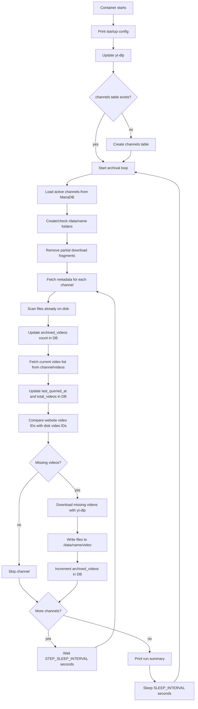

# Pornhub Archiver

A small Dockerized archiver for Pornhub model and pornstar channels. It reads channels from a MariaDB database, checks which videos are missing from disk, and downloads missing videos into `/data`.

## Table of Contents

- [Requirements](#requirements)
- [Environment Variables](#environment-variables)
- [Notes](#notes)
- [Database Setup](#database-setup)
- [Adding Channels](#adding-channels)
- [Storage Layout](#storage-layout)
- [Docker](#docker)
- [How It Works](#how-it-works)
- [Contributing](#contributing)

## Requirements

- Docker
- MariaDB or MySQL-compatible server
- Enough disk space for the archived videos

Mounting `/data` to a large HDD is highly recommended.

## Environment Variables

| Variable              | Default     | Description                                                    |
|-----------------------|-------------|----------------------------------------------------------------|
| `STEP_SLEEP_INTERVAL` | `15`        | Seconds to wait between each channel's metadata/download step. |
| `SLEEP_INTERVAL`      | `3600`      | Seconds to sleep after each archival run.                      |
| `DB_HOST`             | `localhost` | Host running the MariaDB server.                               |
| `DB_PORT`             | `3306`      | MariaDB server port.                                           |
| `DB_USER`             | `root`      | Database user used by the archiver.                            |
| `DB_PASSWORD`         | `root`      | Database password.                                             |
| `LOKI_URL`            | empty       | Loki base URL or push endpoint. Leave empty to disable Loki.   |
| `LOKI_USERNAME`       | empty       | Optional Loki basic-auth username.                             |
| `LOKI_PASSWORD`       | empty       | Optional Loki basic-auth password.                             |
| `LOKI_LABELS`         | empty       | Optional extra Loki labels as `key=value,key2=value2`.         |
| `LOKI_APP_LABEL`      | `pornhub-archiver` | Value for the Loki `app` label.                         |
| `LOKI_TIMEOUT`        | `5`         | Seconds to wait when sending a log batch to Loki.              |

## Notes

- The database name is fixed as `ph_archiver`.
- Only rows where `channels.is_active = 1` are archived.
- The container updates `yt-dlp` on startup.
- Partial download fragments are cleaned up at the beginning of each run.

## Database Setup

Create a MariaDB database named `ph_archiver`:

```sql
CREATE DATABASE ph_archiver;
```

The container creates the `channels` table automatically on startup if it does not exist.

## Adding Channels

Channels are added directly in the database. Use any database explorer/admin tool you like, for example DBeaver, HeidiSQL, phpMyAdmin, TablePlus, or DataGrip.

Insert channel links into the `channels.link` column in raw channel format:

```text
https://www.pornhub.com/model/<name>
https://www.pornhub.com/pornstar/<name>
```

Do not add `/videos` or a trailing slash. The archiver normalizes some bad input, but the expected format is the raw channel URL.

Example:

```sql
INSERT INTO channels (link)
VALUES ('https://www.pornhub.com/model/example-name');
```

## Storage Layout

Downloaded content is written under `/data`.

For a channel URL like:

```text
https://www.pornhub.com/model/<name>
```

files are stored under:

```text
/data/<name>/
```

Video files are named like:

```text
[video_id] <title>.<ext>
```

The archiver may also write related files such as thumbnails and metadata, depending on `yt-dlp` output.

## Docker

Build the image:

```bash
docker build -t pornhub-archiver .
```

Run it:

```bash
docker run -d \
  --name pornhub-archiver \
  -v /path/to/archive:/data \
  -e DB_HOST=host.docker.internal \
  -e DB_PORT=3306 \
  -e DB_USER=root \
  -e DB_PASSWORD=root \
  -e SLEEP_INTERVAL=3600 \
  -e STEP_SLEEP_INTERVAL=15 \
  -e LOKI_URL=http://loki:3100 \
  -e LOKI_LABELS=env=prod \
  pornhub-archiver
```

If MariaDB is running in another container, put both containers on the same Docker network and use the MariaDB container name as `DB_HOST`.

## How It Works



## Contributing

Found an issue? Open a GitHub issue with details.

Pull requests to improve the project are welcome.
