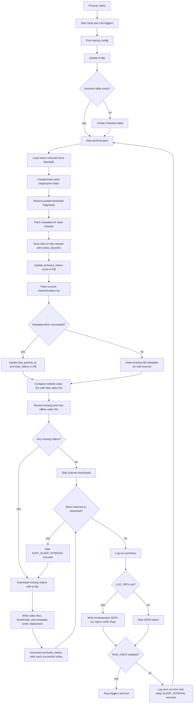

# Pornhub Archiver

A small Dockerized archiver for Pornhub model and pornstar channels. It reads channels from a MariaDB database, checks which videos are missing from disk, and downloads missing videos into `/data`.

## Table of Contents

- [Requirements](#requirements)
- [Environment Variables](#environment-variables)
- [Notes](#notes)
- [Database Setup](#database-setup)
- [Adding Channels](#adding-channels)
- [Storage Layout](#storage-layout)
- [Docker](#docker)
- [Docker Compose](#docker-compose)
- [Running Locally](#running-locally)
- [Recovery and Offline Videos](#recovery-and-offline-videos)
- [How It Works](#how-it-works)
- [Contributing](#contributing)

## Requirements

- Docker
- MariaDB or MySQL-compatible server
- Enough disk space for the archived videos

Mounting `/data` to a large HDD is highly recommended.

## Environment Variables

| Variable                        | Default            | Description                                                    |
|---------------------------------|--------------------|----------------------------------------------------------------|
| `STEP_SLEEP_INTERVAL`           | `15`               | Seconds to wait between each channel's metadata/download step. |
| `SLEEP_INTERVAL`                | `3600`             | Seconds to sleep after each archival run.                      |
| `RUN_ONCE`                      | `false`            | Run one archival pass, then exit instead of sleeping forever.  |
| `CONCURRENT_FRAGMENT_DOWNLOADS` | `4`                | Number of video fragments yt-dlp may download concurrently.    |
| `DATA_PATH`                     | `/data`            | Directory where archived channel folders are written.          |
| `DB_HOST`                       | `localhost`        | Host running the MariaDB server.                               |
| `DB_PORT`                       | `3306`             | MariaDB server port.                                           |
| `DB_USER`                       | `root`             | Database user used by the archiver.                            |
| `DB_PASSWORD`                   | `root`             | Database password.                                             |
| `LOKI_URL`                      | empty              | Loki base URL or push endpoint. Leave empty to disable Loki.   |
| `LOKI_USERNAME`                 | empty              | Optional Loki basic-auth username.                             |
| `LOKI_PASSWORD`                 | empty              | Optional Loki basic-auth password.                             |
| `LOKI_LABELS`                   | empty              | Optional extra Loki labels as `key=value,key2=value2`.         |
| `LOKI_APP_LABEL`                | `pornhub-archiver` | Value for the Loki `app` label.                                |
| `LOKI_TIMEOUT`                  | `5`                | Seconds to wait when sending a log request to Loki.            |
| `LOG_PATH`                      | `/logs`            | Directory for local log files. Set empty to disable file logs. |
| `CONSOLE_COLORS`                | `true`             | Set to `false` to disable ANSI colors in console output.       |

## Notes

- The database name is fixed as `ph_archiver`.
- Only rows where `channels.is_active = 1` are archived.
- The container updates `yt-dlp` on startup.
- Partial download fragments are cleaned up at the beginning of each run.

## Database Setup

Create a MariaDB database named `ph_archiver`:

```sql
CREATE DATABASE ph_archiver;
```

The container creates the `channels` table automatically on startup if it does not exist.

The expected schema is:

```sql
CREATE TABLE channels (
    id int auto_increment primary key,
    link text not null,
    comment text null,
    total_videos int default 0 not null,
    archived_videos int default 0 not null,
    added_on datetime default current_timestamp() not null,
    last_queried_at datetime default current_timestamp() not null,
    is_active tinyint(1) default 1 not null,
    constraint channels_link_uindex unique (link) using hash
);
```

## Adding Channels

Channels are added directly in the database. Use any database explorer/admin tool you like, for example DBeaver, HeidiSQL, phpMyAdmin, TablePlus, or DataGrip.

Insert channel links into the `channels.link` column in raw channel format:

```text
https://www.pornhub.com/model/<name>
https://www.pornhub.com/pornstar/<name>
```

Do not add `/videos` or a trailing slash. The archiver normalizes some bad input, but the expected format is the raw channel URL.

Example:

```sql
INSERT INTO channels (link)
VALUES ('https://www.pornhub.com/model/example-name');
```

## Storage Layout

Downloaded content is written under `/data`.
Local log files are written under `/logs` and named with the container startup time in `YYYY-MM-DD HH:mm:ss` format.
Each archival run also writes a timestamped JSON report under `/logs`, named by the run finish time, with a machine-readable summary of scanned channels, missing/downloaded/failed videos, cleanup count, bytes added, elapsed time, and per-channel counts. Older run reports are kept.

For a channel URL like:

```text
https://www.pornhub.com/model/<name>
```

files are stored under:

```text
/data/<name>/
```

Video files are named like:

```text
[video_id] <title>.<ext>
```

The archiver may also write related files such as thumbnails and metadata, depending on `yt-dlp` output.

## Docker

Published image tags follow the helper scripts in this repository:

```text
h4ckerxx44/pornhub_archiver:latest
h4ckerxx44/pornhub_archiver:v4
```

Build the image:

```bash
docker build -t pornhub-archiver .
```

Run it:

```bash
docker run -d \
  --name pornhub-archiver \
  -v /path/to/archive:/data \
  -v /path/to/logs:/logs \
  -e DB_HOST=host.docker.internal \
  -e DB_PORT=3306 \
  -e DB_USER=root \
  -e DB_PASSWORD=root \
  -e DATA_PATH=/data \
  -e SLEEP_INTERVAL=3600 \
  -e RUN_ONCE=false \
  -e CONCURRENT_FRAGMENT_DOWNLOADS=4 \
  -e STEP_SLEEP_INTERVAL=15 \
  -e LOKI_URL=http://loki:3100 \
  -e LOKI_LABELS=env=prod \
  pornhub-archiver
```

If MariaDB is running in another container, put both containers on the same Docker network and use the MariaDB container name as `DB_HOST`.

## Docker Compose

Example with the archiver and MariaDB on the same network:

```yaml
services:
  mariadb:
    image: mariadb:11
    environment:
      MARIADB_DATABASE: ph_archiver
      MARIADB_ROOT_PASSWORD: root
    volumes:
      - mariadb-data:/var/lib/mysql

  pornhub-archiver:
    image: h4ckerxx44/pornhub_archiver:latest
    depends_on:
      - mariadb
    environment:
      DB_HOST: mariadb
      DB_PORT: 3306
      DB_USER: root
      DB_PASSWORD: root
      DATA_PATH: /data
      SLEEP_INTERVAL: 3600
      RUN_ONCE: false
      CONCURRENT_FRAGMENT_DOWNLOADS: 4
      STEP_SLEEP_INTERVAL: 15
      LOG_PATH: /logs
    volumes:
      - /path/to/archive:/data
      - /path/to/logs:/logs

volumes:
  mariadb-data:
```

## Running Locally

Install the package dependencies in a Python environment, make sure `ffmpeg` is available on `PATH`, and run:

```bash
export DB_HOST=localhost
export DB_PORT=3306
export DB_USER=root
export DB_PASSWORD=root
export DATA_PATH=/path/to/archive
export LOG_PATH=/path/to/logs
export CONCURRENT_FRAGMENT_DOWNLOADS=4
export RUN_ONCE=true

python -m pornhub_archiver.run
```

The database must already exist before startup:

```sql
CREATE DATABASE ph_archiver;
```

## Recovery and Offline Videos

At the start of each archival run, the tool removes incomplete yt-dlp fragments such as `.part` files and `.part-Frag*` files from each channel directory. Completed files are left in place.

The tool scans filenames on disk and treats the leading `[video_id]` prefix as the archived video ID. If a video is present on disk but no longer appears in the channel listing, it is reported as `now offline`; the file is not deleted.

When a video is missing on disk but still appears in the channel listing, the tool downloads it with yt-dlp into the channel directory and increments `archived_videos` after a successful download.

## How It Works



## Contributing

Found an issue? Open a GitHub issue with details.

Pull requests to improve the project are welcome.
